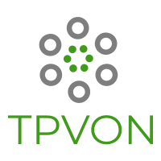

<center>


Una aplicación para terminales de punto de venta con software libre.
---
</center>

Tpv en linea dirigido a las micropymes del sector servicios.
Proyecto desarrollado con una metodología de trabajo propia de muy facil entendimiento.
Su sistema de objetos es sencillo y fácil de implementar y se puede crear y destruir partes de la aplicación fácilmente. 
Su principales características son su sencillez de programar y velocidad de ejecución de la aplicación.

## Inicio 🚀

¡IMPORTANTE! 
Acceda a toda esta información y mucha más en [el Manual de TPVOn](https://nestorpons.github.io/TPVON/)
___
_Estas instrucciones te permitirán obtener una copia del proyecto en funcionamiento en tu máquina local para propósitos de desarrollo y pruebas._

Mira **Deployment** para conocer como desplegar el proyecto.


### Pre-requisitos 📋

_Disponer de un hosting o servidor LAMP local_
* PHP 7.3.10 o superior 
* MYSQL 8.0
* Docker y docker-compose - para ejecutarlo en local con el servidor que viene incorporado
* Navegador: 
    * Chrome 41.0.2272.101 o superior
    * Mozilla Firefox 57.0.3 o superior
    * Microsoft Edge 41.16299.15.0 o superior
    * Opera 50.0 o superior
    * Safari 6.0.2 o superior 

### Instalación 🔧

_Clone o descargue el proyecto_

```
git clone https://github.com/nestorPons/tpv.git
```

_Entre en la carpeta del proyecto_ 

```
cd TPVON
```
Instale las dependencias con composer 
``` 
composer install
``` 

Otorgue permisos a todas las subcarpetas y archivos

```
sudo chown -R $(whoami):33 ./ | sudo chmod -R 0777 ./
```

#### Para desplegarlo en su hosting
_Suba la carpeta descargada a su hosting mediante ftp o git._

**La constante PUBLIC_FOLDER_ROOT declarada en apptpv/config/folders.php contiene la carpeta publica del servidor.**
que por defecto es htdocs.


#### Para desplegarlo en servidor local
Si se desea se dispone de un contenedor docker con lamp instalado en el mismo proyecto
Para construirlo por primera vez: 
```
.server/docker-compose build 
```
Para activalo:
```
.server/docker-compose up -d 
```
Para pararlo:
```
.server/docker-compose down
```

Desde el navegador acceda al localhost o su su hosting donde desplegó su aplicación.
```
localhost/tpv/index.php o www.tuhosting.com/tpv/index.php
``` 
_Se inicia el configurado de la aplicación en su primer acceso._


## Deployment 📦

Consulte su hosting para saber que opciones le proporciona.
Manualmente solo debe copiar la carpeta del prollecto en la localización deseada. 

## Construido con
Herramientas:
 
* [padrecedano](https://github.com/padrecedano/PHP-PDO) - Conexión base datos con pequeñas modificaciones en la clase.
* [jcavat](https://github.com/jcavat/docker-lamp) - Servidor docker con adaptaciones para el proyecto. 
* [lessphp](https://leafo.net/lessphp/) - Compilador less con php. 
* [linearicons](https://linearicons.com/) - Iconos de la aplicación.
* [cacoo.com](https://cacoo.com) - Diagramas 
* [Minify](https://github.com/matthiasmullie/minify) - Minificador de codigo js y css en php
* [Freelogodesing](https://es.freelogodesign.org/) - Logotipo
* [PHPMailer](https://github.com/nestorPons/tpv/wiki/Base-de-datos) - Envios de email con php
* [Minicss](https://minicss.org) - Mini fraemwork css 
* [MkDocs](https://www.mkdocs.org) - Documentación
 

## Contribuyendo 🖇️

Por favor lee el [CONTRIBUTING.md](https://gist.github.com/villanuevand/xxxxxx) para detalles de nuestro código de conducta, y el proceso para enviarnos pull requests.

## Donaciones 
* [Paypal](paypal.me/reservatucita)

## Manual 📖

Puedes encontrar mucho más de cómo utilizar este proyecto en nuestra [Manual de TPVOn](https://nestorpons.github.io/TPVON/)

## Versionado 📌

Usamos [SemVer](http://semver.org/) para el versionado. Para todas las versiones disponibles, mira los [tags en este repositorio](https://github.com/nestorpons/TPVON/tags) y en el manual en la sección [Versiones de TPVOn](https://nestorpons.github.io/TPVON/versionado)

## Autores ✒️

_Menciona a todos aquellos que ayudaron a levantar el proyecto desde sus inicios_

* **Néstor Pons** - *Trabajo Inicial* - [nestorpons](https://github.com/nestorpons)


También puedes mirar la lista de todos los [contribuyentes](https://github.com/nestorpons/TPVON/contributors) quíenes han participado en este proyecto. 

## Licencia 📄

Este proyecto está bajo la Licencia (MIT) - mira el archivo [LICENSE.md](LICENSE.md) para detalles

___
⌨️ con ❤️ por [Nestorpons](https://github.com/Nestorpons) 😊
